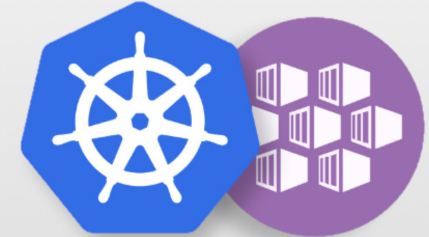

<p align="center">
    
</p>

# Introduction
K8s全名為Kubernetes，之所以被稱作K8s，是因為名稱的k與s之間有8個英文字母而得其名。  
K8s是一種可用來自動化部屬、擴展及管理多個容器（Container）的系統，適用於當容器數量增加，需要穩定容器環境，以及管理資源或權限分配的狀況。

## 名詞介紹
- Container  
Container中文稱作容器，指的是將應用程式沙箱化，且包含應用程式所需的關聯系統程式、必要的執行檔等內容，讓其無須再透過另外部署安裝，即可在各種容器平台中執行。

- Pod  
Pod則為K8s運作的最小單位，中文可稱作容器集，意即一個Pod內部可含一個或是多個Container（視運行需求會有一或多個容器同時運行）。而一個Pod會對應到一個應用程式，同一個Pod中的Containers則會共享相同的網路資源（如：IP地址、主機名稱等）。

- Node  
Node則還分為2種：
    1. Worker Node  
    Worker Node為主要執行的運行節點，且一個Worker Node會對應一台機器。內部還可細分為kubelet、kube-proxy及Container Runtime 3個元件。
    2. Control Plane  
    舊簡稱Master Node，負責各個Worker Node的管理，可稱作是K8S的發號施令的中樞。其內部由kube-apiserver、etcd、kube-scheduler以及kube-controller-manager 4個元件組成。

## 優點
- 服務、系統部屬方便  
由於容器可在任何容器平台運行，因此無論是同時將多個Container部屬到一台機器，或是多個Container部屬至多台機器都不是問題。
- 自動化管理，重啟、擴張皆可行  
K8s可自動偵測、管理各Container的狀態，若有需要，可對Container執行自動擴展。而若偵測到有Container發生故障，也可自動重啟以確保服務正確且持續地運行。
- 彈性化運用  
K8s中每個服務、系統皆可獨立部屬，因此不會因為其中一個系統出現錯誤而影響整個運作，甚至各Container也可依各自需求來修改，運用上擁有高度彈性化。

## 整體架構


# How to use
## AKS Setting
1. 登入  
    ```
    az login --tenant <TenantID>
    ```
2. 取得受控 Kubernetes 叢集的存取認證  
    --resource-group > 資源群組的名稱  
    --name > 受控叢集的名稱
    ```
    az aks get-credentials --resource-group <MyGroup> --name <MyCluster>
    ```
## K8S Use
- 執行操作  
    ## kubectl config  
    - 取得所有Context
    ```
    kubectl config get-contexts
    ```
    - 使用指定Context
    ```
    kubectl config use-context <ContextName>
    ```
    - 查看當前Context
    ```
    kubectl config current-context
    ```
    ## kubectl get
    - 取得所有pods
    ```
    kubectl get pods -A
    ```
    ## kubectl log
    - 查看log
    ```
    kubectl logs -f <PodName> -n <NameSpace>
    ```
    ## kubectl cp
    - 複製檔案
    ```
    # kubectl to 本機
    kubectl cp <NameSpace>/<PodName>:<src> <dst>
    # 本機 to kubectl
    kubectl cp <src> <NameSpace>/<PodName>:<dst>
    ```
    ## kubectl describe
    - 查看pod設定
    ```
    kubectl describe pods <PodName> -n <NameSpace>
    ```
